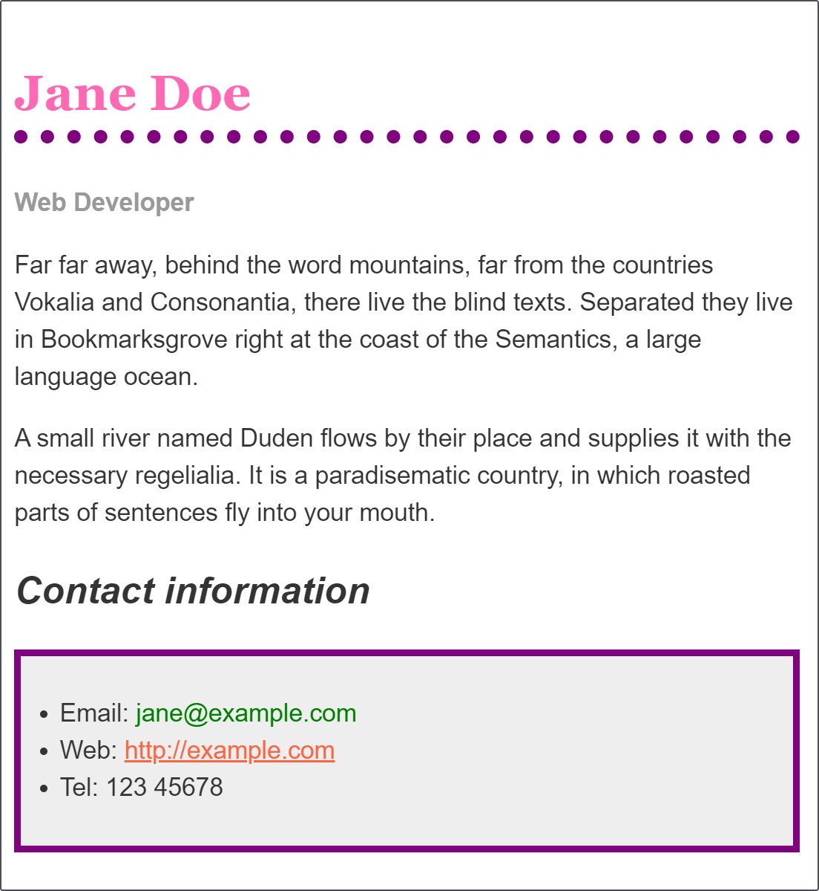

# [Styling a biography page](https://developer.mozilla.org/en-US/docs/Learn/CSS/First_steps/Styling_a_biography_page)

__Objective__:  To have a play with some CSS and test your new-found knowledge.

## Starting point

You can work in the live editor below, or you can [download the starting point file](https://github.com/mdn/css-examples/blob/main/learn/getting-started/biog-download.html) to work with in your own editor.

## Project brief

Make the following changes to this CSS:

1. Make the level one heading pink, using the CSS color keyword hotpink.
2. Give the heading a 10px dotted border-bottom which uses the CSS color keyword purple.
3. Make the level 2 heading italic.
4. Give the ul used for the contact details a background-color of #eeeeee, and a 5px solid purple border. Use some padding to push the content away from the border.
5. Make the links green on hover.

## Expected result

## My result

## [Live result](https://goodalex223.github.io/MDN/biografy/index.html)
