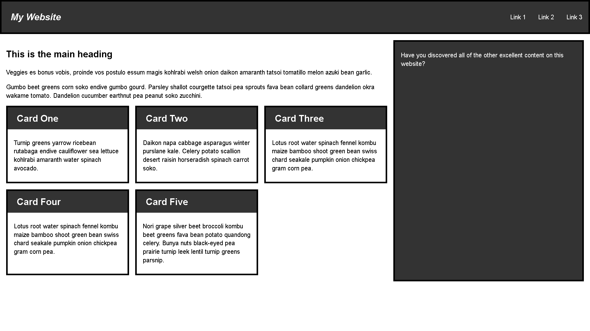

# [Test your skills: Responsive web design and media queries](https://developer.mozilla.org/en-US/docs/Learn/CSS/CSS_layout/rwd_skills)

__Objective__:  to assess whether you understand [how to use media queries](https://developer.mozilla.org/en-US/docs/Learn/CSS/CSS_layout/Media_queries) and get you working with responsive web design with a practical task. Everything you need to know to complete this task is covered in the layout lessons in the [CSS layout module](https://developer.mozilla.org/en-US/docs/Learn/CSS/CSS_layout).

## Task

[Download the starting point for this task](https://github.com/mdn/css-examples/blob/main/learn/tasks/rwd/rwd-download.html). Open the downloaded HTML file in your browser and you will find a wireframed site which will load in a mobile device in a readable manner. You can drag your window smaller or use the [responsive design view in Firefox DevTools](https://firefox-source-docs.mozilla.org/devtools-user/index.html#responsive-design-mode) to view this as if on a phone.

Your task is to create a desktop version of this layout which displays when there is enough screen width to accommodate it. Your final result should look like the image below:

There are a number of ways that you could create the desktop layout, enjoy experimenting. You could also add a second breakpoint perhaps creating a layout that would work well on a tablet in portrait mode.

## My Result

