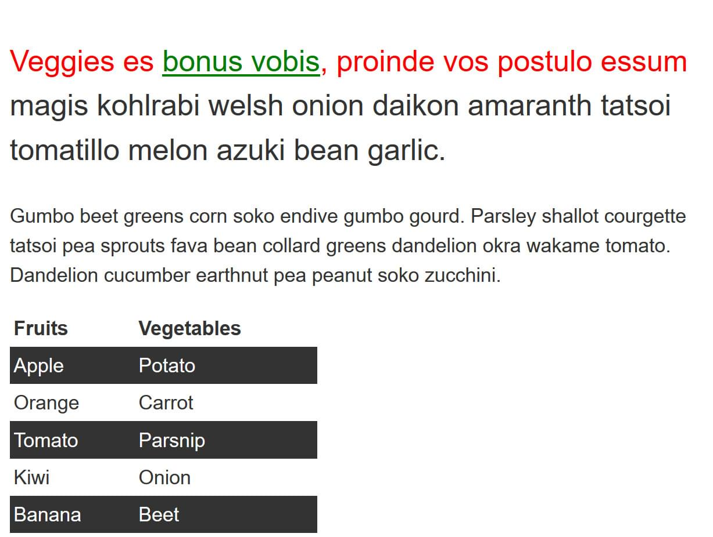
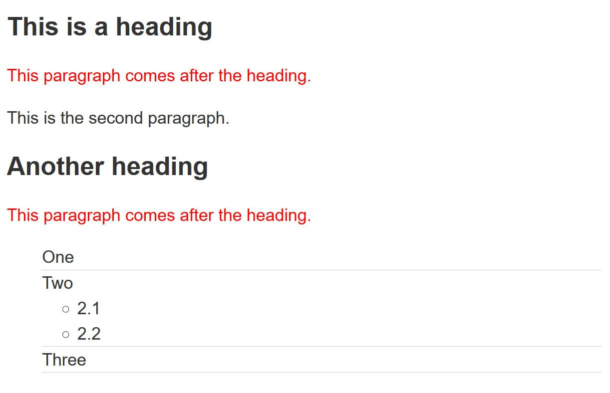
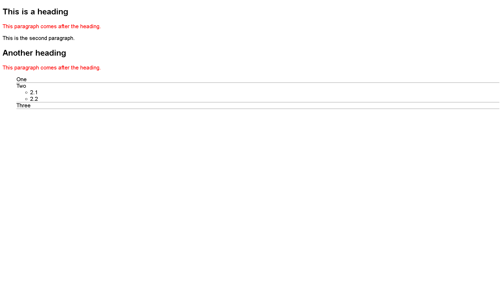

# [Test your skills: Selectors](https://developer.mozilla.org/en-US/docs/Learn/CSS/Building_blocks/Selectors/Selectors_Tasks)

The aim of this skill test is to assess whether you understand CSS selectors.

## [Task 1](https://developer.mozilla.org/en-US/docs/Learn/CSS/Building_blocks/Selectors/Selectors_Tasks#task_1)

In this task, use CSS to do the following things, without changing the HTML:

+ Make `<h1>` headings blue.
+ Give `<h2>` headings a blue background and white text.
+ Cause text wrapped in a `` to have a font-size of 200%.

### Start point

HTML code of html/task1.html file

### Expected result

### Result

## [Task 2](https://developer.mozilla.org/en-US/docs/Learn/CSS/Building_blocks/Selectors/Selectors_Tasks#task2)

In this task, we want you to make the following changes to the look of the content in this example, without changing the HTML:

+ Give the element with an id of `special` a __yellow background__.
+ Give the element with a class of `alert` a __1px grey border__.
+ If the element with a class of `alert` also has a class of `stop`, make the __background red__.
+ If the element with a class of `alert` also has a class of `go`, make the __background green__.

### Start point

HTML code of html/task2.html file

### Expected result

### Result

## [Task 3](https://developer.mozilla.org/en-US/docs/Learn/CSS/Building_blocks/Selectors/Selectors_Tasks#task3)

In this task, we want you to make the following changes without adding to the HTML:

+ Style links, making the __link-state__ orange, __visited links__ green, and remove the underline __on hover__.
+ Make the __first element inside the `container`__ font-size: 150% and the __first line of that element__ red.
+ __Stripe every other row in the table__ by selecting these rows and giving them a background color of #333 and foreground of white.

### Start point

HTML code of html/task3.html file

### Expected result

### Result

## [Task 4](https://developer.mozilla.org/en-US/docs/Learn/CSS/Building_blocks/Selectors/Selectors_Tasks#task4)

In this task, we want you to do the following:

+ Make any paragraph that directly follows an `<h2>` element red.
+ Remove the bullets and add a 1px grey bottom border only to list items that are a direct child of the ul with a class of `list`.

### Start point

HTML code of html/task4.html file

### Expected result

### Result

## [Task 5](https://developer.mozilla.org/en-US/docs/Learn/CSS/Building_blocks/Selectors/Selectors_Tasks#task5)

In this task, add CSS using attribute selectors to do the following:

+ Target the `<a>` element with a `title` attribute and make the border pink (border-color: pink).
+ Target the `<a>` element with an `href` attribute that contains the word "contact" somewhere in its value and make the border orange (border-color: orange).
+ Target the `<a>` element with an `href` value starting with "https" and give it a green border (border-color: green).

### Start point

+ HTML code of html/task5.html file
+ CSS rule for anchor

### Expected result

### Result

Part of the screen with the result

