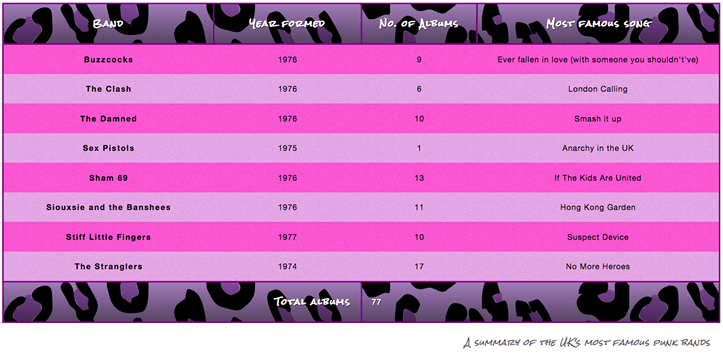

# [Styling our table](https://developer.mozilla.org/en-US/docs/Learn/CSS/Building_blocks/Styling_tables#styling_our_table)

__Objective__:  To learn how to effectively style HTML tables.

## Expected result

## My result

## [Live result](https://goodalex223.github.io/MDN/styling_table/index.html)
