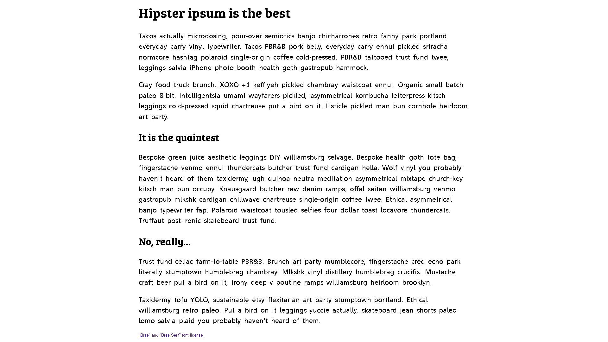

# [Active learning: A web font example](https://developer.mozilla.org/en-US/docs/Learn/CSS/Styling_text/Web_fonts#active_learning_a_web_font_example)

With this in mind, let's build up a basic web font example from first principles. It's difficult to demonstrate this using an embedded live example. So instead we would like you to follow the steps detailed in the below sections to get an idea of the process.

You should use the [web-font-start.html](https://github.com/mdn/learning-area/blob/main/css/styling-text/web-fonts/web-font-start.html) and [web-font-start.css](https://github.com/mdn/learning-area/blob/main/css/styling-text/web-fonts/web-font-start.css) files as a starting point to add your code to (see the [live example](https://mdn.github.io/learning-area/css/styling-text/web-fonts/web-font-start.html)). Make a copy of these files in a new directory on your computer now. In the `web-font-start.css` file, you'll find some minimal CSS to deal with the basic layout and typesetting of the example.

## Finding fonts

For this example, we'll use two web fonts: one for the headings and one for the body text. To start with, we need to find the font files that contain the fonts. Fonts are created by font foundries and are stored in different file formats.

Let's find some fonts! Go to [Font Squirrel](https://www.fontsquirrel.com/) and choose two fonts:

1. A nice interesting font for the headings (maybe a nice display or slab serif font)
2. A slightly less flashy and more readable font for the paragraphs.

When you've found a font, press the download button and save the file inside the same directory as the HTML and CSS files you saved earlier. It doesn't matter whether they are TTF (True Type Fonts) or OTF (Open Type Fonts).

Unzip the two font packages (Web fonts are usually distributed in ZIP files containing the font file(s) and licensing information). You may find multiple font files in the package — some fonts are distributed as a family with different variants available, for example thin, medium, bold, italic, thin italic, etc. For this example, we just want you to concern yourself with a single font file for each choice.

## Generating the required code

Now you'll need to generate the required code (and font formats). For each font, follow these steps:

1. Make sure you have satisfied any licensing requirement if you are going to use this in a commercial and/or Web project.
2. Go to the Fontsquirrel [Webfont Generator](https://www.fontsquirrel.com/tools/webfont-generator).
3. Upload your two font files using the Upload Fonts button.
4. Check the checkbox labeled "Yes, the fonts I'm uploading are legally eligible for web embedding."
5. Click Download your kit.

After the generator has finished processing, you should get a ZIP file to download. Save it in the same directory as your HTML and CSS.

If you need to support legacy browsers, select the "Expert" mode in the Fontsquirrel Webfont Generator, select SVG, EOT, and TTF formats before downloading your kit.

## Implementing the code in your demo

At this point, unzip the webfont kit you just generated. Inside the unzipped directory you'll see some useful items:

* Two versions of each font: the .woff, .woff2 files.
* A demo HTML file for each font — load these in your browser to see what the font will look like in different usage contexts.
* A stylesheet.css file, which contains the generated @font-face code you'll need.

To implement these fonts in your demo, follow these steps:

1. Rename the unzipped directory to something easy and simple, like fonts.
2. Open up the stylesheet.css file and copy the two @font-face rulesets into your web-font-start.css file — you need to put them at the very top, before any of your CSS, as the fonts need to be imported before you can use them on your site.
3. Each of the url() functions points to a font file that we want to import into our CSS. We need to make sure the paths to the files are correct, so add fonts/ to the start of each path (adjust as necessary).
4. Now you can use these fonts in your font stacks, just like any web safe or default system font

You should end up with a demo page with some nice fonts implemented on them. Because different fonts are created at different sizes, you may have to adjust the size, spacing, etc., to sort out the look and feel.

## Result

