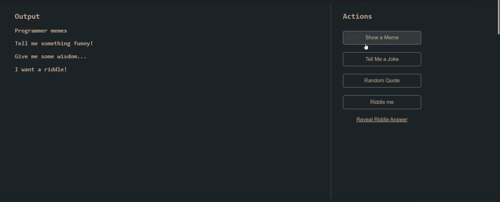
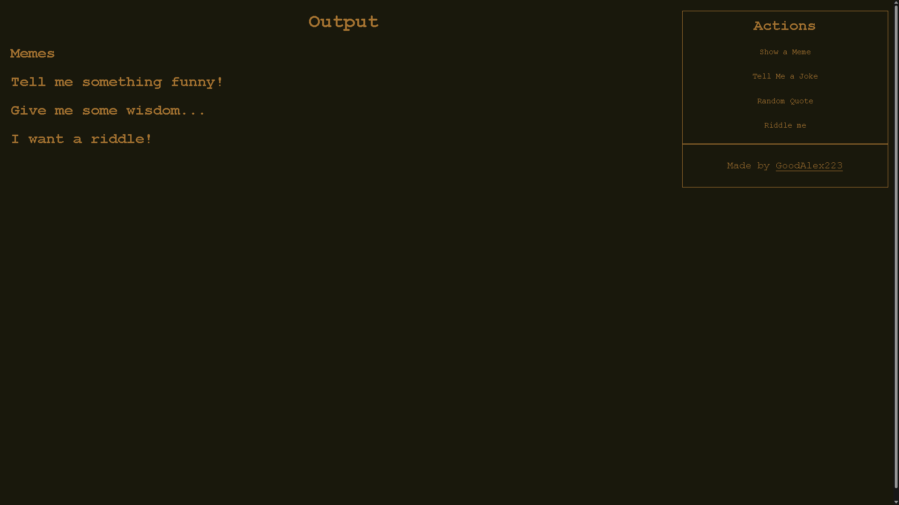

# Frontend Web Development Bootcamp Course (JavaScript, HTML, CSS)

__Objective__: Use a DOM to loop in our javascript into our html and bring it alive into a dynamic web page.

YouTube link to video with project brief and tips: [https://youtu.be/zJSY8tbf_ys?t=44637](https://youtu.be/zJSY8tbf_ys?t=44637)

## Expected result

## My result

## [Live result](https://goodalex223.github.io/freecodecamp/memes/index.html)
