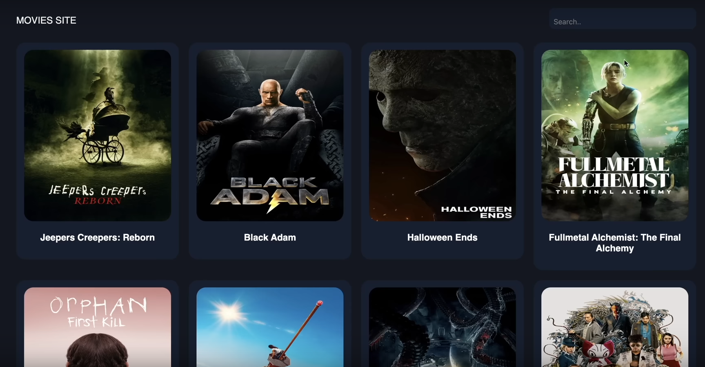
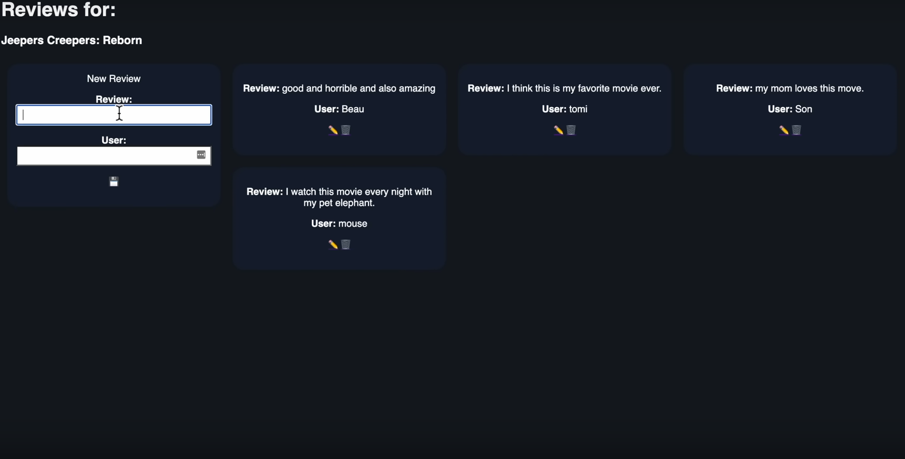
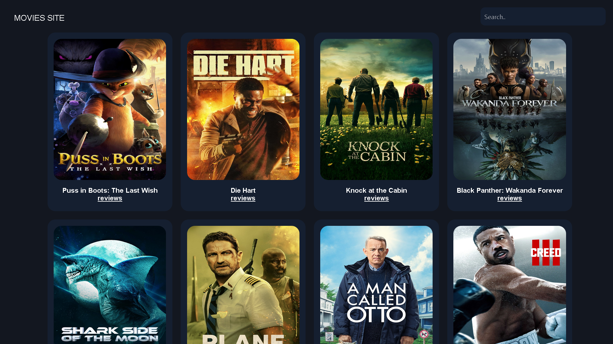
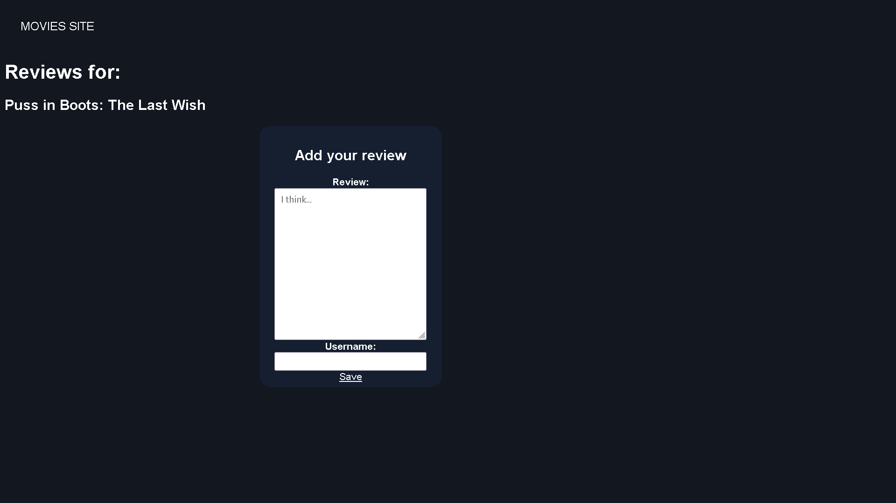

# [Frontend movie app](https://youtu.be/nu_pCVPKzTk?t=17526)

__Objective__: Create a front-end web app with HTML, CSS and JavaScript

YouTube link to video with project brief and tips: [https://youtu.be/nu_pCVPKzTk?t=17526](https://youtu.be/nu_pCVPKzTk?t=17526)

## Expected result

## My result

## [Live result](https://goodalex223.github.io/freecodecamp/movies/index.html)