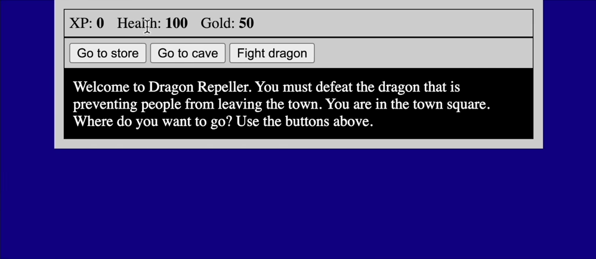

# Mini rpg game on JavaScript

__Objecive__: Learn all the basics of JavaScript programming by coding an RPG game lne by line.

Understand better how everything works together.

YouTube link to video with project brief and tips: [https://youtu.be/nu_pCVPKzTk?t=11749](https://youtu.be/nu_pCVPKzTk?t=11749)

## Expected result

## My result

## [Live result](https://goodalex223.github.io/freecodecamp/rpg/index.html)
