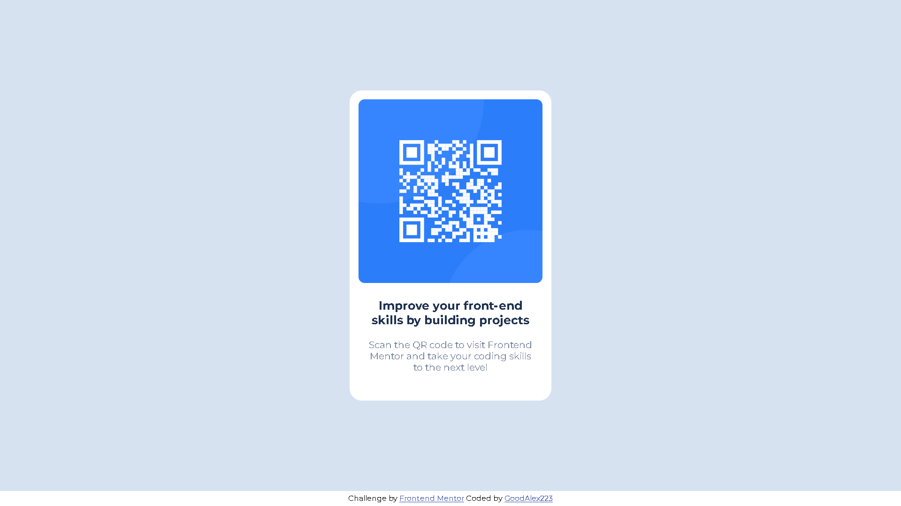

# Frontend Mentor - QR code component solution

This is a solution to the [QR code component challenge on Frontend Mentor](https://www.frontendmentor.io/challenges/qr-code-component-iux_sIO_H). Frontend Mentor challenges help you improve your coding skills by building realistic projects. 

## Table of contents
- [Overview](#overview)
  - [Screenshot](#screenshot)
  - [Links](#links)
- [My process](#my-process)
  - [Built with](#built-with)
  - [What I learned](#what-i-learned)
  - [Continued development](#continued-development)
  - [Useful resources](#useful-resources)
- [Author](#author)

## Overview

### Screenshots



### Links
- Solution URL: [GitHub](https://github.com/GoodAlex223/goodalex223.github.io/tree/main/qr-code)
- Live Site URL: [goodalex223.github.io/qr-code/](https://goodalex223.github.io/qr-code/index.html)

## My process

### Built with
- Semantic HTML5 markup
- CSS custom properties
- Flexbox
- Border-box
- Mobile-first workflow

### What I learned
I was looking for a way to center a card with a quartercode. The first article that helped me figure it out was "How to Center Anything with CSS - Align a Div, Text, and More" by Kris Koishigawa on freecodecamp.org

One way to center elements was to use the flexbox method to define the content to be centered.
```css
.container {
    display: flex;
    justify-content: center;
}
```

I also determined the exact size of the container for correct display and limited the minimum height so that when the window height decreases, the display does not break
```css
.container {
    width: 100vw;
    height: 97vh;
    min-height: 550px;
}
```

### Continued development
In my next projects, I would like to:
1. Write my own styles using a pre-processor, such as:
   * Sass
   * Less
   * Stylus
2. Train my eye for detail by getting my solution as close to the design as I can
3. Try estimating the time it will take for me to build the project. Then see if the time taken matches up to my estimate.
4. Hone my work with flexbox model

### Useful resources
- [How to Center Anything with CSS - Align a Div, Text, and More](https://www.freecodecamp.org/news/how-to-center-anything-with-css-align-a-div-text-and-more/) - This helped me to understand how use flexbox model

## Author
- GitHub - [github.com/GoodAlex223](https://github.com/GoodAlex223)
- Website - [goodalex223.github.io](https://goodalex223.github.io/)
- Frontend Mentor - [@GoodAlex223](https://www.frontendmentor.io/profile/yourusername)
- Gmail - [alexminak32@gmail.com](mailto:alexminak32@gmail.com)
