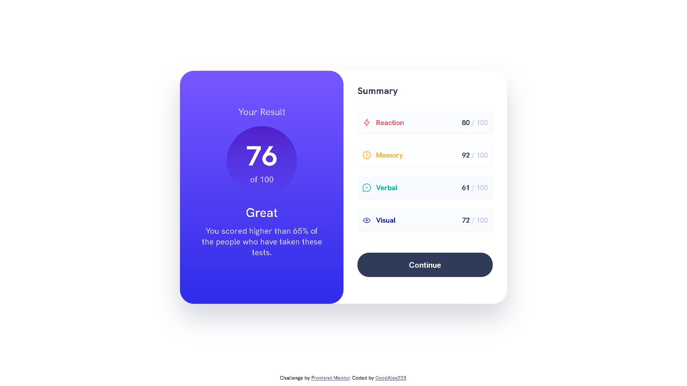
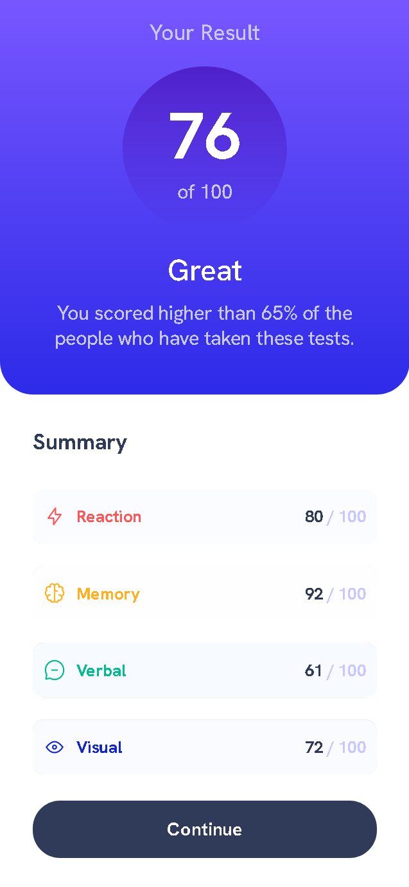

# Frontend Mentor - Results summary component solution

This is a solution to the [Results summary component challenge on Frontend Mentor](https://www.frontendmentor.io/challenges/results-summary-component-CE_K6s0maV). Frontend Mentor challenges help you improve your coding skills by building realistic projects.

## Table of contents

- [Overview](#overview)
  - [The challenge](#the-challenge)
  - [Screenshot](#screenshot)
  - [Links](#links)
- [My process](#my-process)
  - [Built with](#built-with)
  - [What I learned](#what-i-learned)
  - [Continued development](#continued-development)
  - [Useful resources](#useful-resources)
- [Author](#author)

## Overview

### The challenge

Users should be able to:

- View the optimal layout for the interface depending on their device's screen size
- See hover and focus states for all interactive elements on the page

### Screenshot




### Links

- Solution URL: [https://github.com/GoodAlex223/goodalex223.github.io/tree/main/frontendmentor/results-summary-component-main](https://github.com/GoodAlex223/goodalex223.github.io/tree/main/frontendmentor/results-summary-component-main)
- Live Site URL: [https://goodalex223.github.io/frontendmentor/results-summary-component-main/index.html](https://goodalex223.github.io/frontendmentor/results-summary-component-main/index.html)

## My process

### Built with

- Semantic HTML5 markup
- PUG markup
- CSS custom properties
- SCSS properties
- Flexbox
- Grid
- Mobile-first workflow
- Dynamic fill

### What I learned

I have studied the work with Pug, CSS, and their online compilers, practiced Mobile-first workflow and dynamic data filling. I learned more about variable/static fonts and how to create a fallback for correct operation in most browsers.

The most difficult part for me was figuring out how to fix the button at 4 or more categories of the summary section. I came up with fixing the maximum height of the category list container, indicating to show the scroll when overflowing, as well as using a flexbox container for the button, specifying a minimum height in mobile view and centering it vertically

```css
#summmary-section ul {
  padding: 0;
  width: 100%;
  height: 100%;
  overflow: scroll;
  max-height: 26rem;
  margin: 0;
}

#summmary-section .button-container {
  display: flex;
  align-items: center;
  height: 30%;
  min-height: 10rem;
}
```

Where 26rem is the height of the 4x list of items with their top margin

### Continued development

In future projects I want:

- more use of variables and functions for a better possibility of changing the design of the page. For example, 26rem is written as distance-item length * 4 + top margin * 3;
- adhere to the naming methodology for BEM 101 classes;
- more practice with scss, pug preprocessors, and dynamic filling with js;

### Useful resources

- [YouTube Sass Tutorial](https://youtu.be/Zz6eOVaaelI) -- great Saas tutorial. Helped me understand Sass
- [Sass-lang Sass guide](https://sass-lang.com/guide) -- great Sass guide. Helped me understand Sass
- [vincentntang sass media queries](https://www.vincentntang.com/sass-media-queries/) -- media queries in Sass. Helped me write media query
- [boxshadows](https://boxshadows.com/) -- this tool helped me made thin border of li items
- [pimpmytype variable-font-fallback](https://pimpmytype.com/variable-font-fallback/) -- helped me use variable fonts and write fallbacks for them

## Author

- Website - [goodalex223.github.io](https://goodalex223.github.io)
- Frontend Mentor - [@goodalex223](https://www.frontendmentor.io/profile/goodalex223)
- GitHub - [GoodAlex223](https://github.com/GoodAlex223/)
