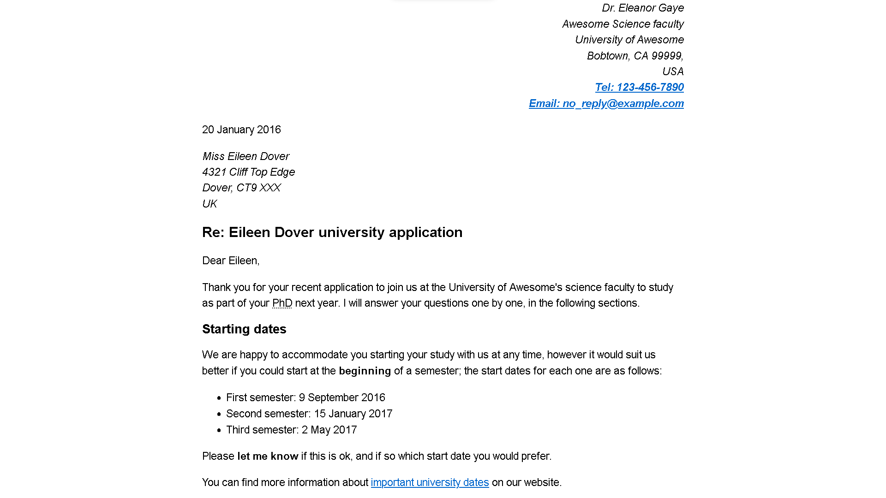
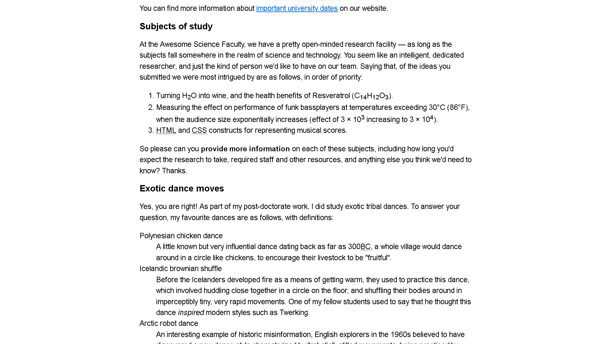
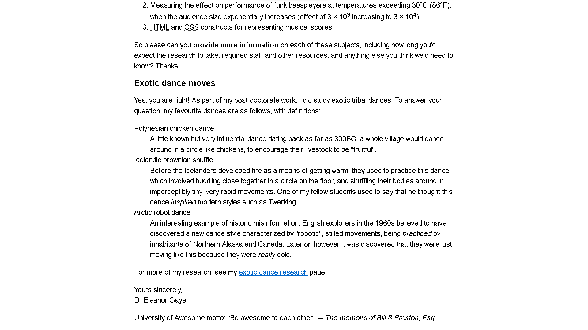
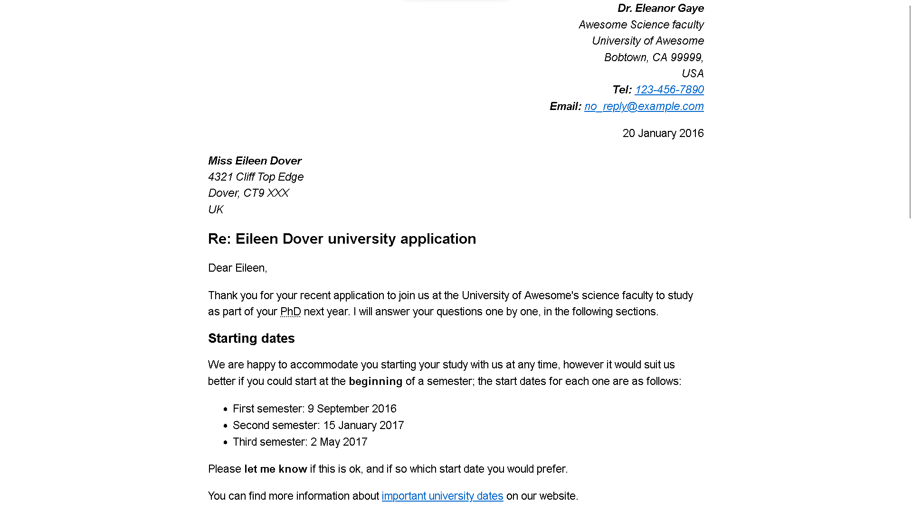
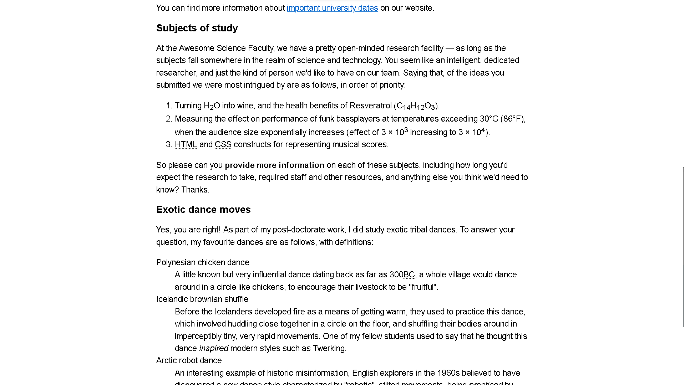
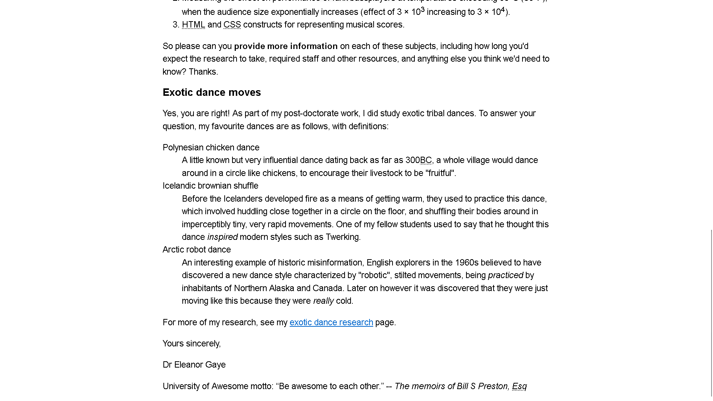

# Mark up a letter

## Table of contents

- [Overview](#overview)
  - [Screenshot](#screenshot)
    - [First Result](#first-result)
    - [Final Result](#final-result)
  - [Links](#links)
- [My process](#my-process)
  - [Requirements](#requirements)
    - [Block/structural semantics](#blockstructural-semantics)
    - [Inline semantics](#inline-semantics)
    - [The head of the document](#the-head-of-the-document)
  - [Built with](#built-with)
  - [What I learned](#what-i-learned)
  - [Useful resources](#useful-resources)
- [Author](#author)

## Overview

Mark up a letter that needs to be hosted on a university intranet. The letter is a response from a research fellow to a prospective PhD student concerning their application to the university.

### Screenshot

#### First Result

Using only TODO list

#### Final Result

Using TODO list and screenshot of expected result

### Links

- [MDN exercise: Mark up a letter](https://developer.mozilla.org/en-US/docs/Learn/HTML/Introduction_to_HTML/Marking_up_a_letter)

## My process

DONE(TODO) list

### Requirements

#### Block/structural semantics

- Use appropriate document structure including doctype, and `<html>`, `<head>` and `<body>` elements.
- In general, the letter should be marked up as an organization of headings and paragraphs, with the following exception. There is one top level heading (the "Re:" line) and three second level headings.
- Use an appropriate list type to mark up the semester start dates study subjects, and exotic dances.
  - the semester start dates study subjects
  - exotic dances
- Put the two addresses inside `<address>` elements. Each line of the address should sit on a new line, but not be in a new paragraph.

#### Inline semantics

- The names of the sender and receiver (and Tel and Email) should be marked up with strong importance.
- The four dates in the document should have appropriate elements containing machine-readable dates.
- The first address and first date in the letter should have a class attribute value of sender-column. The CSS you'll add later will cause these to be right aligned, as it should be in the case in a classic letter layout.
- Mark up the following five acronyms/abbreviations in the main text of the letter — "PhD," "HTML," "CSS," "BC," and "Esq." — to provide expansions of each one.
  - "PhD"
  - "HTML"
  - "CSS"
  - "BC"
  - "Esq"
- The six sub/superscripts should be marked up appropriately — in the chemical formulae, and the numbers 103 and 104 (they should be 10 to the power of 3 and 4, respectively).
  - in the chemical formulae
  - the numbers 103 and 104 (they should be 10 to the power of 3 and 4, respectively)
- Try to mark up at least two appropriate words in the text with strong importance/emphasis.
- There are two places where the letter should have a hyperlink. Add appropriate links with titles. For the location that the links point to, you may use http://example.com as the URL.
- Mark up the university motto quote and citation with appropriate elements.

#### The head of the document

- The character set of the document should be set as utf-8 using the appropriate meta tag.
- The author of the letter should be specified in an appropriate meta tag.
- The provided CSS should be included inside an appropriate tag.

## Built with

- HTML5 markup
- CSS

## What I learned

- Read code requirements more carefully
- Meaning of most abbreviations
- Help cursor style

## Useful resources

Resources that helps me:

- [Time element datetime attribute](https://developer.mozilla.org/en-US/docs/Web/HTML/Element/time)
- [Anchor href options: Mailto, tel](https://developer.mozilla.org/en-US/docs/Web/HTML/Element/a)
- [Address element](https://developer.mozilla.org/en-US/docs/Web/HTML/Element/address)
- [Abbr element](https://developer.mozilla.org/en-US/docs/Web/HTML/Element/abbr)
- [BC abbr meaning](https://translate.academic.ru/%D0%B4%D0%BE%20%D0%BD%D0%B0%D1%88%D0%B5%D0%B9%20%D1%8D%D1%80%D1%8B/ru/en/)
- [ESQ meaning](https://www.abbreviations.com/ESQ)

## Author

- GitHub - [github.com/GoodAlex223](https://github.com/GoodAlex223)
- Website - [goodalex223.github.io](https://goodalex223.github.io/)
- Gmail - [alexminak32@gmail.com](mailto:alexminak32@gmail.com)
